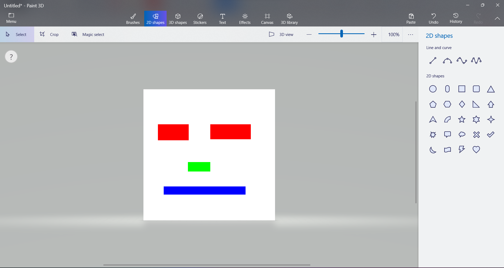
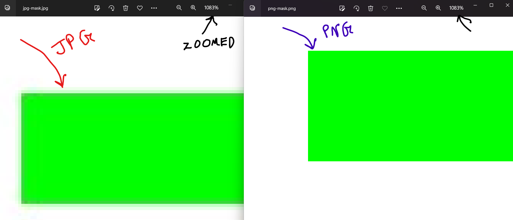
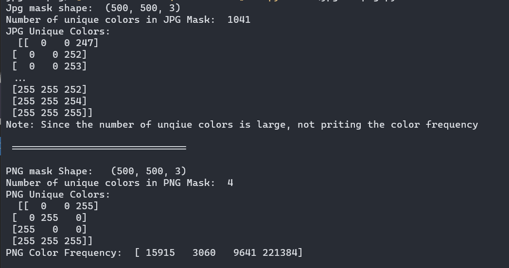

# Segmentation Mask: The curse of JPG and a possible cure

---

- Image segmentation is a task that requires a set of training images and their corresponding segmentation masks. Within the AI industry, I have seen it first-hand that developers and companies store their self-tagged precious segmentation labels in “JPG” format. 

- **However, they often don’t realize that JPG images are stored using a lossy compression format and the segmentation mask gets corrupted when saved in JPG format.**

- In this repo, we will see how JPG’s information loss is a big problem during segmentation training and propose a heuristic approach to convert the JPG segmentation masks to PNG masks. 

---

### JPG Corruption:

- Let's create a RGB segmentation mask and save it as JPG and PNG images simultaneously. I have created one for our task which can be viewed below.
  
  ```
  Please note: The image has only four colors which are: 
  BLUE,GREEN,RED and WHITE
  ```



- If both the JPG and PNG masks are zoomed to an extensive level, we can observe that the edges of JPG masks are blurry and varous shades of green are visible. On the other hand, the PNG image is intact. 



- If we look at the unique colors from the masks, we can observe that, JPG image has lot of unique colors but our mask should only contain 4 unique colors which are: RED, BLUE, GREEN and WHITE. 
  
  <mark color = "yellow">JPG MASK: **<u>1041 Unique colors</u>**</mark>
  
  <mark color = "yollow">PNG MASK: **<u>4 Unique colors</u>**</mark>
  
  

- **If you are a deep-learning practioner, you will realize that that having so many different colors is a segmentation mask has very undesirable effect on the segmentation training.**

---

### Finally, we also propose a heuristic based solution to convert curropted JPG masks to 100% accurate PNG masks.

- The solution is available in the code-file: <mark>**jpg-to-png.py**</mark>
  
  `RUN the code using: <mark>python jpg-to-png.py`
